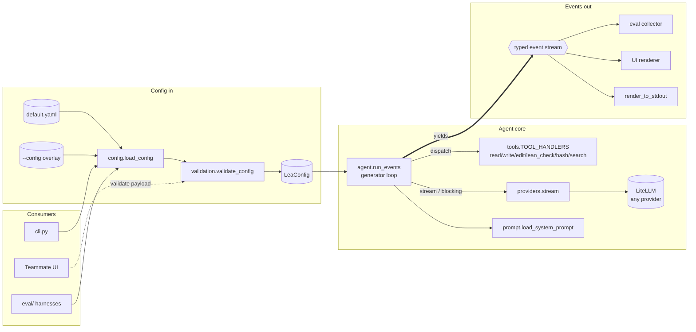
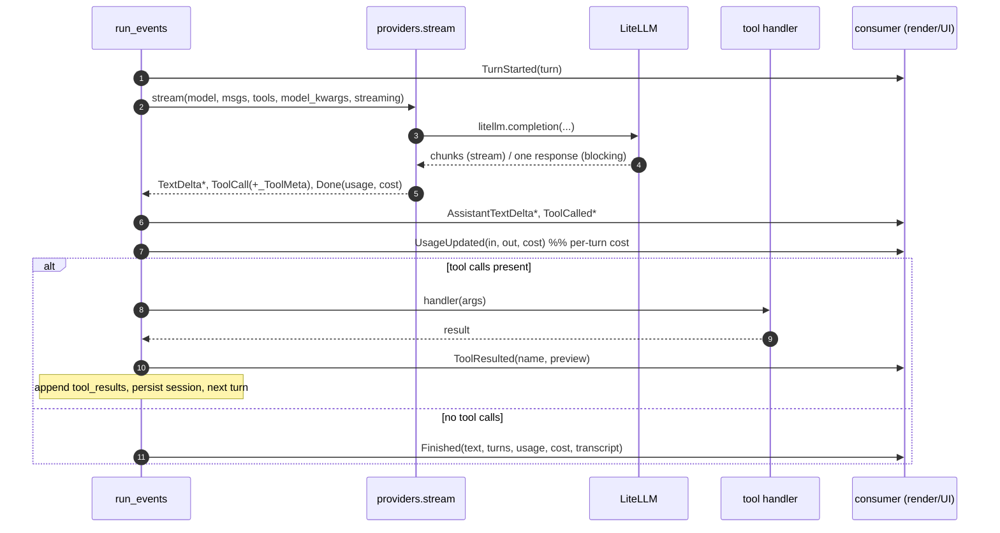

# Lea design

How Lea is put together: a **config-driven** Lean-proving agent with a single
**config-in / event-out** contract. The agent is the *product*; the CLI, a UI,
and the eval harnesses are all *consumers* that drive the same core.

> See [decisions.md](decisions.md) for *why* each choice was made (and how it
> maps to mini-swe-agent).

## At a glance

- **Config in** — a `LeaConfig` (model, `model_kwargs`, `stream`, prompt variant,
  max turns) built from `default.yaml` + an optional `--config` overlay, validated
  by an I/O-free validator.
- **Loop** — `run_events()` is a generator: it calls the model via LiteLLM, runs
  tools, and **yields typed events**. It never prints.
- **Events out** — consumers render the event stream however they like: the CLI
  reproduces a terminal transcript with per-turn cost; a UI renders live; eval
  collects them.

## Architecture



Key property: **the engine swap and the streaming/blocking choice never touch the
loop or the consumers** — `providers.stream()` always yields the same event types,
so everything to the right of it is invariant.

## Turn lifecycle

One iteration of the loop, from `run_events` through a consumer:



The `max_turns` guard at the top of the loop short-circuits to a
`Finished(reason="max_turns")` before streaming.

## Components

| Module | Responsibility |
|---|---|
| `config.py` | `load_config(path)` — read `default.yaml` base, overlay `--config`, hand to the validator. File I/O only. |
| `validation.py` | `LeaConfig` schema + `validate_config(dict)` — pure, I/O-free, raise-on-first; the UI/API can call it on a payload. |
| `errors.py` | Typed `LeaError`→`ConfigError`→{Format, UnknownKey, MissingKey, InvalidValue}. |
| `prompt.py` | System-prompt variants (`default`/`sketch`/`fill`/`reflect`) + optional `lea.md` append. |
| `providers.py` | `stream()` over `litellm.completion`; streaming/blocking paths; neutral→OpenAI message + tool conversion; LiteLLM cost. |
| `agent.py` | `run_events()` generator core; `run()` backward-compat wrapper; session persistence. |
| `tools.py` | The six tools + `TOOL_HANDLERS` dispatch. |
| `events.py` | The frozen event dataclasses (the contract). |
| `render.py` | `render_to_stdout(events)` — default CLI consumer; per-turn cost; returns `(text, transcript)`. |
| `cli.py` | Arg parsing, `--config`, CLI overrides; drives `run_events` → `render_to_stdout`. |

## Event contract

`run_events()` yields, in order: `SessionResumed?`, then per turn
`TurnStarted` → `AssistantTextDelta*` → `ToolCalled*` → `UsageUpdated` →
`ToolResulted*`, and finally `Finished(reason, text, turns, session_id, model,
usage, cost, transcript)` with `reason ∈ {completed, max_turns}`.

## Config schema

```yaml
model:
  name: gemini/gemini-3.1-pro-preview   # LiteLLM provider/model
  stream: true                          # true → live tokens; false → one blocking call
  model_kwargs:                         # open passthrough to litellm.completion
    max_tokens: 16384
agent:
  prompt_variant: default
  max_turns: null                       # null → run until done
```

## Extension points (planned)

The event stream + config seam is what later steps hang off:

- **Tool registry / custom tools / removal** — make `tools` declarative in config.
- **MCP** — merge MCP-server tools into the tool list at startup.
- **Skills** — inject procedural-knowledge prompt fragments.
- **Swappable verifier** — `lean_check`/SafeVerify/future verifiers behind one tool interface.
- **Pluggable `model_class`** — non-LiteLLM backends (mini-swe-agent has this).
